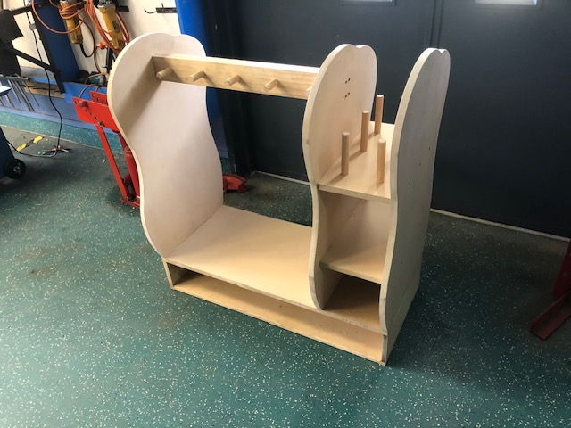
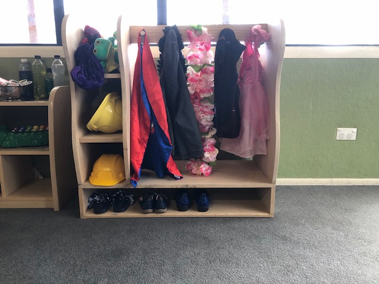

# Item storage for early childhood kids

## 📌 Overview
This was my year 12 project for the course product design. I worked with a main client and stakeholders who gave me a problem and certain requirements that they needed for the product to have. For this project, the children had play clothes, shoes and hand puppets did not have a proper storage space, and the client and stakeholder wanted a custom built product to store all these items.

## 🎯 Objectives
- Must be easily accessible to the children
- Easy to clean
- Stable and strong
- Hold 6 hand puppets, 10 dresses and 3 shoes.

## 🛠 Tools & Concepts Used
- Inventor
- Basic carpentry tools and knowledge

## 🔍 Methodology
The first thing I needed to do was find out the requirements that both my client and stakeholders needed for this storage item. The requirements included :
- Safety for the children i.e. no sharp corners, no splinters, smooth
- Easy accessibility for children to take and put back items
- Hand puppets peg storage to help with fine motor skills
- Strong and sturdy so it would not fall over easily
- Shoe storage area
- Dress storage area
- Easy to clean
- Fit for kids aged 1-5 years old

 

Prior to understanding the requirements, I researched on current clothes storage units. I found that there were mainly adult storage units and the only children ones were not for the age requirement I needed. I decided to take inspiraton from existing adult storage units and implement features that would allow the storage item to hold everything required. I drew up multiple design ideas. After discussing with my clients and stakeholders, we reached a final design.

 

After the brainstorm, I headed to the workshop to start the construction process. I decided to make the whole product out of MDF as it was a material which was easy to clean, work with, and had a less chance of forming splinters if damaged. I used many tools during this construction process. Some of those tools included :  

- Drill press
- Belt sander
- Jigsaw
- Drills
- Screwdrivers
- Sandpaper
- Router
 
Some of these tolls I had never used before, and it was interesting and fun to learn as I went. I attached all the parts of the storage item using wood glue and screws with counter sinks for a very secure joint. I realised during the costruction process that I could have adjusted some of the design so the build could be easier. Instead of making a separate shoe storage and attaching the other parts ontop of the shoe storage, I could have used less materials and made assembly much easier if I had just made it part of the side panels. This was a mistake on my end as I had not thought ahead of this potential issue. However, it was too late into the construction process to restart or adjust the parts. I had to glue and attach the parts via screws. After that, the storage item just needed proper sanding around the edges before it was completed and sent to the childcare.

## 📊 Results
- The storage item worked perfectly
- The size of the whole item was perfect for the kids in the childcare
- All puppets, clothes and shoes fit well
- client and stakeholder were happy with rounded edges and corners
- Children showed interest and could easily take and put back items held by the storage item

## 📸 Project Images
Unfortunately, this project took place a long time ago and I no longer have the images of the design and construction process and only of the completed item.
### Completed Item

## 📚 What I Learned
- How to work with clients and stakeholders and how to implement their requirements into a product
- How to use tools and the way the materials reacted during the building process
- It can be expensive to fix something the deeper you are in a project
- It is important to look out for potential issues during designing process and rectify them early on, especially before materials are used.
